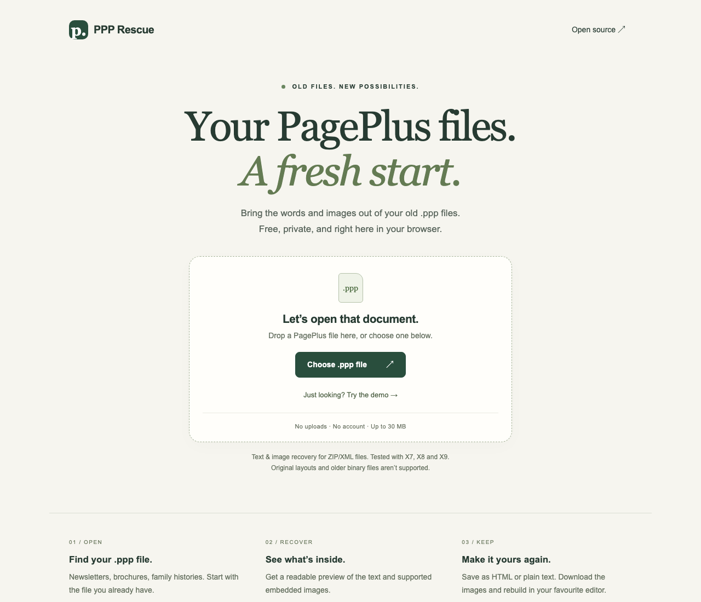
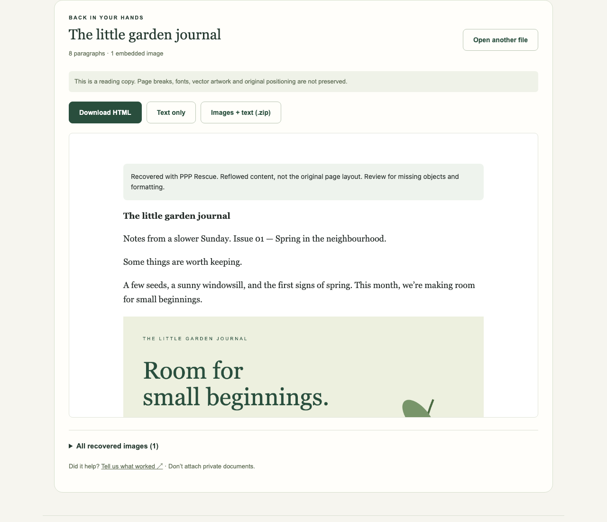

# PPP Rescue

Recover text and images from PagePlus `.ppp` files in your browser.

**[Open the tool →](https://recoverppp.com/)** · [Feedback](https://github.com/Dryxio/ppp-rescue/issues/new?template=feedback.yml) · [Roadmap](https://github.com/Dryxio/ppp-rescue/issues/10)

Free and open source. No account or document uploads.



## Use it

1. Choose a `.ppp` file or try the demo.
2. Read the recovered text and browse the image gallery.
3. Download HTML, plain text, individual images or a ZIP.



*Screenshots use an original synthetic demo, not a native PagePlus rendering.*

## Compatibility

ZIP/XML publications; tested on 11 documents from one author spanning X7–X9. Embedded PNG, JPEG and GIF images are identified by their contents, including those stored as `.bin`.

This is content recovery: original layout, fonts, vector artwork, layer visibility and generated fields such as page numbers are not preserved. Older binary PPP files, WDP images and external linked images are unsupported. Review warnings and keep your original document. Story order may differ from page order.

For a reading-copy PDF, open the HTML export and choose **Print → Save as PDF**.

## Opening a recovery path for a legacy format

**To our knowledge, PPP Rescue is the first open-source, browser-based tool specifically built to recover story text and supported embedded images from Serif PagePlus ZIP/XML publications without installing PagePlus or uploading the document.**

PagePlus publications can outlive the software needed to open them. PPP Rescue gives their owners an independent, inspectable way to recover supported content and reuse it in modern tools.

Our review on 18 September 2026 found PagePlus still listed as a future import target by Document Liberation Project and explicitly unsupported by dexvert. [Read the research, comparison scope and priority-claim limits](docs/originality.md).

## Privacy

Files stay in your browser. No analytics or AI services. The host receives ordinary website requests. Limits: 30 MB input, 100 MB expanded archive, 5,000 entries. Processing and downloads run in a cancellable worker with a 30-second timeout. Image and XML limits bound supported document complexity.

[Report a problem](https://github.com/Dryxio/ppp-rescue/issues/new?template=feedback.yml) with the version, browser and missing content. Issues are public: don’t attach private documents.

## Development

Node.js 20.19+ or 22.12+.

```sh
npm ci
npm run dev
npm run build
```

Tests cover Chromium, Firefox and WebKit:

```sh
npx playwright install
npm test
```

Optional `PPP_SAMPLE_DIR` / `PPP_EXPECTED_DIR` enable local original-file tests. Validation documents come from [Softer Views](https://www.softerviews.org/PagePlus.html); third-party documents and fonts are not redistributed.

Vercel serves `dist`. Domain metadata lives in `index.html`, `scripts/seo.mjs`, `public/robots.txt` and `public/sitemap.xml`.

[MIT license](LICENSE). Independent project, not affiliated with Serif or Affinity.
